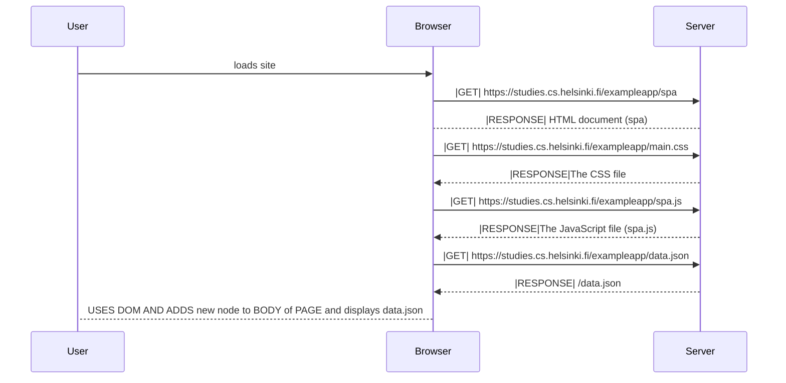

```mermaid
  sequenceDiagram
  User->>Browser: loads site
  Browser->>Server: |GET| https://studies.cs.helsinki.fi/exampleapp/spa
  Server-->Browser: |RESPONSE| HTML document (spa)
  Browser->>Server: |GET| https://studies.cs.helsinki.fi/exampleapp/main.css
  Server-->>Browser:|RESPONSE|The CSS file
  Browser->>Server: |GET| https://studies.cs.helsinki.fi/exampleapp/spa.js
  Server-->>Browser:|RESPONSE|The JavaScript file (spa.js)
  Browser->>Server: |GET| https://studies.cs.helsinki.fi/exampleapp/data.json
  Server-->>Browser:|RESPONSE| /data.json
  Browser-->User: USES DOM AND ADDS new node to BODY of PAGE and displays data.json
```
